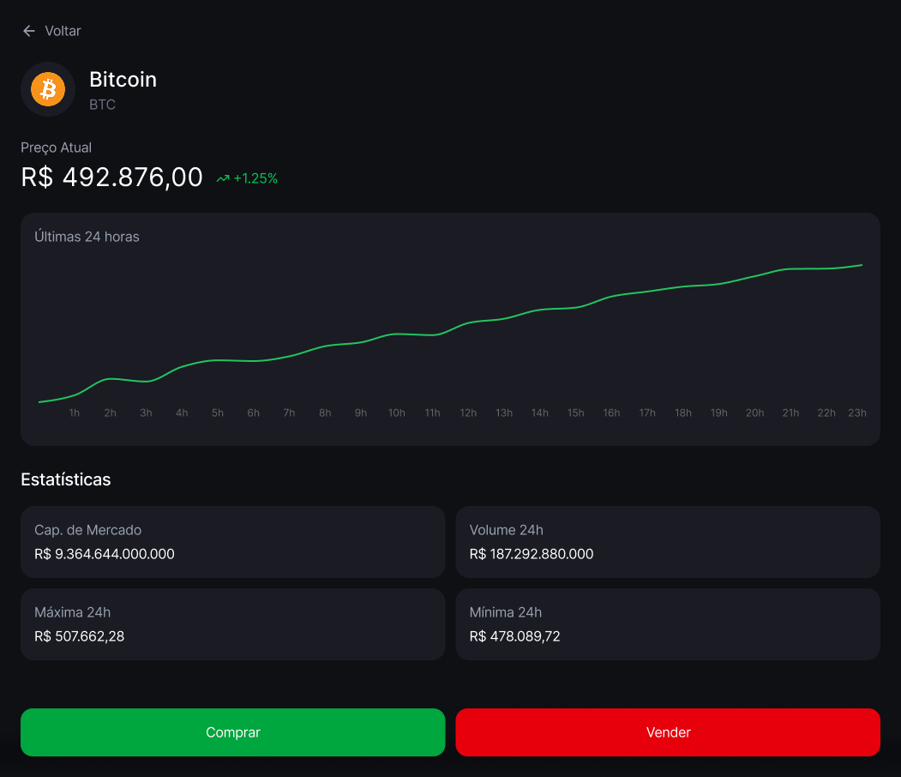

# 💰 Projeto: CryptoTracker (Visão Geral)

Bem-vindo ao seu novo projeto de portfólio! O **CryptoTracker** é uma aplicação web para monitorar o mercado de criptomoedas.

Neste projeto, você atuará como um desenvolvedor Front-end construindo um dashboard que consome dados reais, exibe cotações e permite a navegação entre detalhes de ativos financeiros.

## 🎯 O Objetivo Final
Ao final de 3 semanas, você terá uma aplicação capaz de:
1.  Listar as principais moedas do mercado atualizadas em tempo real.
2.  Filtrar moedas pelo nome.
3.  Mostrar variações de preço com indicadores visuais (verde/vermelho).
4.  Navegar para uma página de detalhes exclusiva de cada moeda.

## 🛠️ Tecnologias Principais
-   **React** (Biblioteca principal)
-   **Vite** (Ferramenta de build - mais rápida que CRA)
-   **Axios ou Fetch API** (Para requisições HTTP)
-   **React Router DOM** (Para navegação entre páginas - Semana 3)

## 🔗 A API (Fonte de Dados)
Usaremos a **CoinGecko API** (versão pública gratuita). Não é necessário cadastro nem chave de API.

**Endpoint Principal (Lista de Moedas):**
```text
[https://api.coingecko.com/api/v3/coins/markets?vs_currency=brl&order=market_cap_desc&per_page=10&page=1&sparkline=false](https://api.coingecko.com/api/v3/coins/markets?vs_currency=brl&order=market_cap_desc&per_page=10&page=1&sparkline=false)
```

## 📸 Telas do Projeto (Preview)

Aqui está o resultado final que vamos construir:

### 1. Dashboard (Home)

*Listagem de moedas com variação de preço em tempo real.*

### 2. Detalhes da Moeda

*Tela exclusiva com gráfico e estatísticas detalhadas.*

---

## 🚀 Como Iniciar o Projeto

```bash
npm create vite@latest cryptotracker -- --template react
cd cryptotracker
npm install
npm run dev
```

# 🎨 Guia de Estilo & Protótipo: CryptoTracker

Este documento contém todas as especificações visuais para o desenvolvimento do projeto. Use-o como referência para configurar seu CSS e garantir que o site fique idêntico ao planejado.

---

## 🔗 Protótipo Visual (Figma)
Antes de codar, visualize o resultado final. Clique no link abaixo para acessar o desenho da interface (UI) e inspecionar os elementos.

👉 **[Acessar Protótipo no Figma](https://www.figma.com/design/ln3YZDbq9qFiJ6qEqaAvkM/CryptoTracker?node-id=0-1&t=vHZCNQuyhONf14yQ-1)**

---

## 🖌️ Tipografia

Utilizaremos a fonte **Inter**, que é padrão em interfaces modernas e financeiras.

- **Fonte:** [Inter (Google Fonts)](https://fonts.google.com/specimen/Inter)
- **Instalação:** Adicione a linha abaixo no topo do seu arquivo CSS.

```css
@import url('[https://fonts.googleapis.com/css2?family=Inter:wght@400;600;700&display=swap](https://fonts.googleapis.com/css2?family=Inter:wght@400;600;700&display=swap)');
```

## 🎨 Paleta de Cores (Dark Mode)

Copie os códigos hexadecimais abaixo para garantir fidelidade ao layout.

| Aplicação | Nome da Cor | Código HEX |
| :--- | :--- | :--- |
| Fundo da Página | Preto Azulado (Deep) | `#121214` |
| Cards / Inputs | Cinza Chumbo | `#202024` |
| Texto Principal | Branco | `#FFFFFF` |
| Texto Secundário | Cinza Claro | `#A8A8B3` |
| Positivo (Alta) | Verde Neon | `#00B37E` |
| Negativo (Baixa) | Vermelho Suave | `#F75A68` |
| Botão Comprar | Verde Sólido | `#00875F` |
| Botão Vender | Vermelho Sólido | `#AB222E` |

---
## ⚡ Acelerador (Setup CSS)

Para facilitar seu trabalho, copie e cole o código abaixo no início do seu arquivo index.css ou App.css. Isso configura as variáveis globais para você usar em todo o projeto.

```css
:root {
  /* Cores do Tema */
  --bg-color: #121214;
  --card-color: #202024;
  
  /* Cores de Texto */
  --text-primary: #FFFFFF;
  --text-secondary: #A8A8B3;
  
  /* Cores de Status */
  --green-primary: #00B37E;
  --red-primary: #F75A68;
  
  /* Cores de Ação */
  --btn-buy: #00875F;
  --btn-sell: #AB222E;
}

/* Reset Básico */
* {
  margin: 0;
  padding: 0;
  box-sizing: border-box;
}

body {
  background-color: var(--bg-color);
  color: var(--text-primary);
  font-family: 'Inter', sans-serif;
  -webkit-font-smoothing: antialiased;
}

/* Exemplo de uso: 
   .card { background-color: var(--card-color); } 
   .price { color: var(--green-primary); }
*/
```